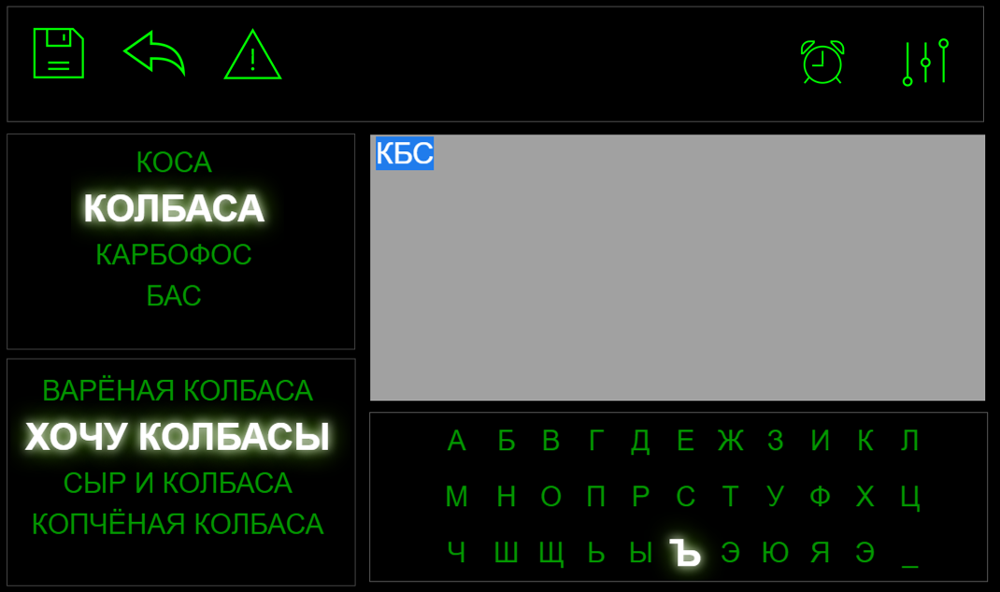

# Предиктивный ввод текста и адаптивное меню
## Термины
*Объект* - выбираемый посредством клавиатуры, смысловой объект - это может быть графический символ или буквенно-цифровое 
сочетание: буква, цифра, буквенно-цифровой код (сокращение, обозначение, аббревиатура), число, слог, слово, фраза.

*Условно статическая клавиатура* - экранная клавиатура у которой на этапе выбора объекта состав одновременно
видимых на экране вариантов выбора остаётся неизменным. Положение и состояние объектов выбора может меняться.

*Динамическая клавиатура* - экранная клавиатура у которой на этапе выбора объекта состав одновременно
видимых на экране вариантов выбора может меняться. Положение и состояние объектов выбора может меняться.

# 1. Предиктивный ввод текста с условно статической экранной клавиатуры

## 1.1 Два режима взаимодействия пользователя с системой
При взаимодействии с системой пользователь преследует две главные цели: управление/действия и коммуникация/общение.
Соответственно интерпретация системой выбранного пользователем объекта может быть двух типов:
- команда/действие
- текст/информация

Таким естественным образом в системе существует два режима работы - командный и режим ввода.
Команды исполняются непосредственно после ввода, а объекты выбранные в режиме ввода накапливаются в буфере
и с ними в дальнейшем возможны различные манипуляции: сохранение, удаление, перемещение/пересылка, редактирование и пр.

## 1.2 Два способа ускорeния выбора объекта
Для ускорения ввода существует два подхода: 
- первый использование различных методов предсказания дальнейшего ввода на основе имеющихся знаний. 
К этой категории относятся все предиктивные технологии, ngram-ы, различные виды деревьев, нейросети, и пр.
- второй использование групповых подсветок с целью сужения множества поиска, т. н. многомерный ввод.

Я предлагаю использовать оба подхода, т.к. они дополняют друг друга.

### 1.2.1 Ввод с использованием предиктивных технологий
Так как набор команд доступных в системе ограничен относительно небольшим числом, использование предиктивных
технологий более актуально при работе в режиме ввода. Хотя, команды, в принципе, тоже можно вводить посимвольно, и
тогда предиктивные технологии будут особенно эффективны, в силу маленького словаря команд, но
мне кажется, для наших нужд, всё же, лучше подойдёт иероглифическое представление команд (иконки, пиктограммы и пр.).
Хотя ничто не мешает использовать оба подхода.

Предсказание ввода возможно на двух основных уровнях:
- на фонетическом уровне (предсказание целого слова по его части - группе звуков, букв)
- на лексическом уровне (предсказание фразы по её части - одному или нескольким словам)
Поэтому для целей предиктивного ввода необходима возможность ввода из нескольких независимо
стимулируемых фреймов/окон

#### 1.2.1.1 Технологии предсказания ввода
На стадии поиска архитектурного решения конкретные технологии не так важны. Важен унивесальный интерфейс предиктора. 
И он представляется мне следующим:
- Верхний уровень абстракции (базовый класс)
  - вход - выбранная последовательнoсть объектов и метод сортировки результата, выход - список предсказаний 
  отсортированный по определённому во входе методу
- Специализированные уровни (указаны только уточнения или дополнения базового класса интерфейса)
  - фонетический уровень: вход - последовательность букв, выход - последовательность слов
  - лексический уровень: вход - последовательность слов (одно или более), выход - последовательность фраз 
  - командный уровень: вход - поледовательность букв команды или пиктограмма команды/группы команд, выход - список 
  команд отсортированных по частоте использования в текущем контексте (контексты использования системы могут 
  быть разными - ввод текста, управление бытовой техникой, общение и пр.)

Сами же технологии подбора вариантов предсказания можно перечислить в виде списка:
- поиск по фонетической схожести (фонетические алгоритмы, например Метафон)
- ngram поиск 
- trie - поиск по префиксному trie дереву
- поиск по суффиксному дереву
- нейросетевые алгоритмы (под этим пунктом скрывается множество различных нейросетевых технологий)

Все вышеперечисленные виды поиска предсказаний ведутся с учётом вариантов опечаток на заданное редакторское расстояние. 
Существуют следующие метрики для определения этого расстояния: 
- Расстояние Левенштейна,
- cos угла между словами в пространстве алфавита
- коэффициент перекрытия
- ещё есть методы Чапмена и много других...

Несмотря на большое разнообразие метрик для определения редакторского расстояния между словами наиболее популярна, судя по 
публикациям на данную тему, метрика Левенштейна и её небольшая уточняющая модификация - метрика Левенштейна-Дамерау.
Почему так, точно не знаю, но подозреваю что из-за хорошего (относительно небольшого по величине по сравнению с прочими)
соотношения сложность/надежность.
 
### 1.2.2 Многомерный ввод
Смысл техники многомерного ввода в том, что для уменьшения общего количества стимулов с целью сокращения продолжительности
одного цикла выбора, стимуляция производится по группам символов, после выбора группы производиться стимуляция подгрупп
выбранной группы и т.д. пока не доходим до нижнего уровня - выбора объекта. При определённых условиях такой подход может
увеличивать скорость ввода, особенно на больших алфавитах. RC-ввод - одна из реализаций такого подхода (используется два
измерения - сначала производится выбор строки, а затем выбор символа в строке - выбор колонки). Многомерный ввод можно также 
назвать сходящимся т.к. множество выбора постепенно сужается и сходится к небольшой группе финального выбора.

## 1.3 Варианты архитектуры пользовательского интерфейса
Исходя из вышесказанного графический интерфейс пользователя должен, на мой взгляд, состоять из панели/фрейма/окна комманд 
(командной клавиатуры), из окна ввода текста и комплекта из трех панелей/фреймов/окон для ввода текста (текстовая клавиатура).
Окно ввода текста при выполнении определённых команд не связанных с вводом текста может быть заменено на специализированные
окна предназначенные для определённых (конкретных) задач, например управление кондиционером или телевизором. Командный режим
может быть чисто пиктограммным или с включенной текстовой клавиатурой для ввода команд текстом с использованием 
предиктивного и (может быть) многомерного ввода (для ускорения)

Примерный вид интерфейса представлен на рисунке ниже. Стимулирующие экранные клавиатуры построены на базе клавиатуры carousel

